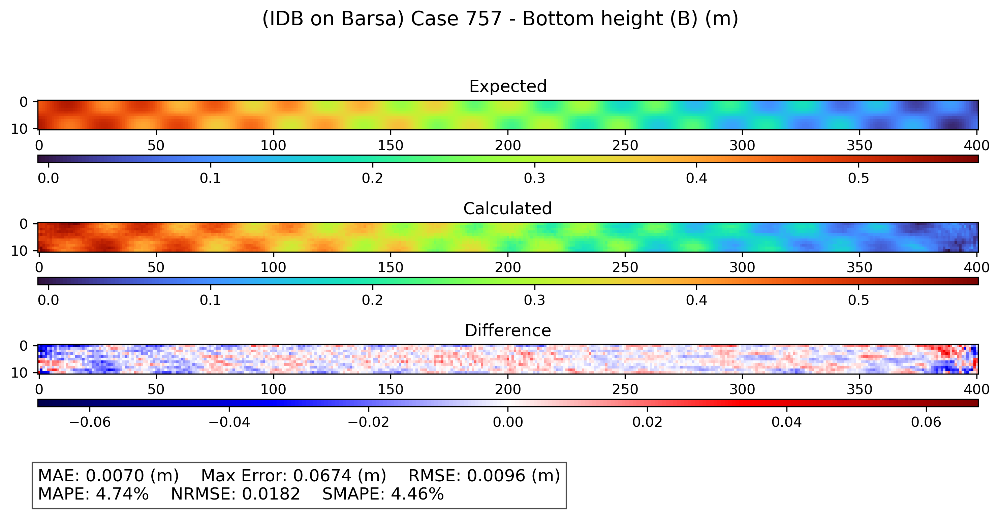
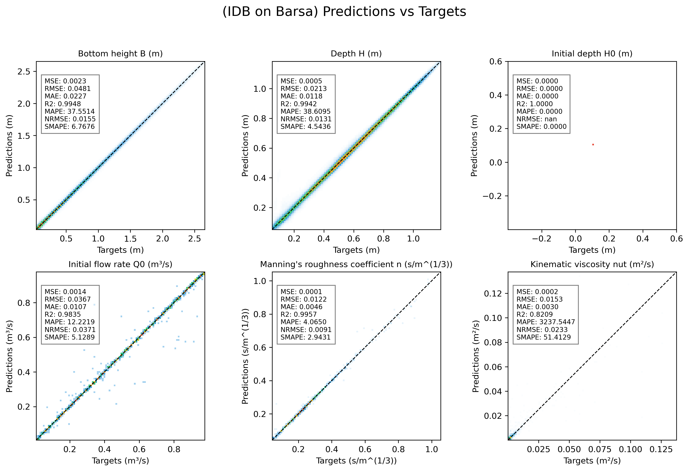

# Surrogate Modeling of Shallow Water Channel Flow using Fourier Neural Operators

[](https://opensource.org/licenses/MIT)[](https://www.python.org/downloads/release/python-3110/)[](https://pytorch.org/)[](https://github.com/astral-sh/ruff)[](https://fastapi.tiangolo.com/)

This repository contains a research codebase for developing data-driven and physics-informed surrogate models for computational fluid dynamics (CFD) in open-channel hydraulics, using **Fourier Neural Operators (FNO)** trained on **TELEMAC-2D** shallow water simulations, this framework works with **direct problems** (predicting depth and velocity fields from hydraulic/geometric boundaries) and **inverse problems** (reconstructing hidden channel bathymetry and hydraulic roughness from observable flow fields).

---

## Visual Showcase: Inverse Bathymetry Reconstruction

The surrogate model demonstrates strong predictive performance on inverse problems, accurately reconstructing 2D channel bed geometries ($z_b$) from surface velocity distributions.


*Figure 1: Bed elevation reconstruction ($z_b$) in the inverse dimensional problem for the alternate bar morphology (**BARSa**). From top to bottom: Expected TELEMAC-2D ground truth, FNO surrogate reconstruction, and absolute spatial difference ($\text{MAE} = 0.007\,\text{m}$, $\text{SMAPE} = 4.46\%$).*


*Figure 2: Parity plots comparing FNO predictions against TELEMAC-2D targets across all variables in the inverse dimensional problem (bed elevation $z_b$, water depth $h$, upstream discharge $Q_0$, and Manning roughness coefficient $n$).*

---

## Table of Contents

- [Project Overview](#project-overview)
- [Physical & Mathematical Formulation](#physical--mathematical-formulation)
  - [Governing Equations](#governing-equations)
  - [Direct vs. Inverse Formulation](#direct-vs-inverse-formulation)
  - [Channel Bed Morphologies](#channel-bed-morphologies)
- [Methodology & Architecture](#methodology--architecture)
- [Repository Structure](#repository-structure)
- [Installation](#installation)
- [Workflow and Usage](#workflow-and-usage)
  - [1. Data Generation (TELEMAC-2D)](#1-data-generation-telemac-2d)
  - [2. Data Processing](#2-data-processing)
  - [3. Model Training & Optimization](#3-model-training--optimization)
  - [4. Evaluation & Visualization](#4-evaluation--visualization)
  - [5. Interactive Web Demo (Prototype)](#5-interactive-web-demo-prototype)
- [Pre-trained Checkpoints](#pre-trained-checkpoints)
- [Citation](#citation)
- [License](#license)

## Project Overview

Traditional numerical solvers for hydrodynamic flows (such as finite element or finite volume discretizations of the Saint-Venant equations) are computationally demanding, limiting their suitability for real-time flood forecasting, uncertainty quantification, and iterative inverse characterization.

This project addresses these challenges by introducing **Fourier Neural Operator (FNO)** surrogates that learn mappings between infinite-dimensional function spaces with discretization invariance and zero-shot super-resolution.

### Key Objectives:

1. **Direct Hydrodynamic Prediction:** Rapidly predict steady-state 2D water depth $h(x, y)$ and velocity fields $u(x, y), v(x, y)$ under varying inflow discharge $Q_0$, downstream depth $h_0$, and bed friction.
2. **Inverse Bathymetry & Roughness Identification:** Accurately reconstruct submerged channel geometry $z_b(x, y)$ and infer hydraulic properties (such as Manning's roughness coefficient $n$) given surface-level velocity observations.
3. **Dimensional vs. Dimensionless Scaling:** Systematically evaluate whether non-dimensionalizing the governing equations via Froude scaling improves operator generalization and data efficiency.
4. **Generalization & Transfer Learning:** Benchmark how models transfer across geometric complexity domains (from planar slopes to complex alternate bars).

---

## Physical & Mathematical Formulation

### Governing Equations

The hydrodynamic simulations resolve the depth-averaged **2D Shallow Water Equations (Saint-Venant equations)**:

$$
\frac{\partial h}{\partial t} + \frac{\partial (h u)}{\partial x} + \frac{\partial (h v)}{\partial y} = 0
$$

$$
\frac{\partial (h u)}{\partial t} + \frac{\partial}{\partial x}\left(h u^2 + \frac{1}{2}g h^2\right) + \frac{\partial (h u v)}{\partial y} = -g h \frac{\partial z_b}{\partial x} - \frac{\tau_{b, x}}{\rho} + \nu_t \nabla^2(h u)
$$

$$
\frac{\partial (h v)}{\partial t} + \frac{\partial (h u v)}{\partial x} + \frac{\partial}{\partial y}\left(h v^2 + \frac{1}{2}g h^2\right) = -g h \frac{\partial z_b}{\partial y} - \frac{\tau_{b, y}}{\rho} + \nu_t \nabla^2(h v)
$$

where:

* $h$ is the water depth, $u$ and $v$ are depth-averaged velocity components along $x$ and $y$.

* $z_b$ is the channel bed elevation.

* $g$ is gravitational acceleration, and $\nu_t$ is turbulent kinematic viscosity.

* $\tau_b$ represents bottom shear stress parameterized by Manning's roughness coefficient $n$:
  
  $\tau_{b, x} = \rho g n^2 \frac{u \sqrt{u^2 + v^2}}{h^{1/3}}, \quad \tau_{b, y} = \rho g n^2 \frac{v \sqrt{u^2 + v^2}}{h^{1/3}}$

### Direct vs. Inverse Formulation

| Formulation     | Inputs                                                                                    | Target Outputs                                                                              |
|:--------------- |:----------------------------------------------------------------------------------------- |:------------------------------------------------------------------------------------------- |
| **Direct (D)**  | Bed topography $z_b(x, y)$, inflow discharge $Q_0$, downstream depth $h_0$, roughness $n$ | Water depth $h(x, y)$, longitudinal velocity $u(x, y)$, transverse velocity $v(x, y)$       |
| **Inverse (I)** | Velocity fields $u(x, y), v(x, y)$                                                        | Bed elevation $z_b(x, y)$, depth $h(x, y)$, roughness $n$, boundary parameters ($Q_0, h_0$) |

Both problems are analyzed under **Dimensional (D)** and **Adimensional / Dimensionless (A)** regimes across three channel bed configurations.

### Channel Bed Morphologies

Three distinct topographic complexity classes are investigated:

* **SLOPE (`SLOPEa`):** Planar, constant-slope channels.
* **NOISE (`NOISEa`):** Topographies perturbed with spatially correlated 2D Gaussian noise fields.
* **BARS (`BARSa`):** Alternate diagonal sediment bars inducing cross-channel recirculations and complex 2D hydrodynamic patterns.

---

## Methodology & Architecture

* **High-Fidelity Training Data:** Generated with the **TELEMAC-2D** finite element solver across parameter spaces sampled via Latin Hypercube Sampling (LHS).
* **Neural Operator Architecture:** Implemented with 2D Fourier Neural Operators (`FNO2d`), computing spectral convolutions in Fourier space to capture global spatial correlations.
* **Physics-Informed Residuals:** Custom loss functions incorporating shallow water equation residuals and boundary condition penalties.
* **Dynamic Loss Weighting:** Implementation of **ReLoBRaLo** (Relative Loss Balancing with Random Lookback) to balance multi-objective data-driven and physics-informed losses.
* **Hyperparameter Optimization:** Distributed Bayesian hyperparameter tuning orchestrated via **Optuna** SQLite databases.

---

## Repository Structure

```
├── config.yml           # Central configuration file for all data, training, and optuna runs
├── environment.yml      # Conda environment specification
├── pyproject.toml       # Python package configuration and linting/tooling settings
├── data/                # Processed HDF5 simulation datasets
├── img/                 # Figures, benchmark comparisons, and documentation assets
├── src/
│   ├── common/          # Utilities (structured logger, reproducibility seeders)
│   ├── ML/              # Machine Learning pipeline
│   │   ├── core/        # Orchestration (Trainer, Finetuner, Optimizer, ResultsLoader)
│   │   ├── modules/     # Low-level primitives (FNO models, HDF5 datasets, PDE losses)
│   │   └── scripts/     # Executable entry points (train, tune, transfer, plot)
│   ├── telemac/         # TELEMAC-2D generation and automation
│   │   ├── modules/     # Mesh builders, boundary/steering file writers
│   │   └── geo/         # Base mesh geometries (.slf)
│   ├── website/         # Lightweight interactive demo application (FastAPI + JS)
│   └── simulation_data_processor.py # SLF to HDF5 dataset aggregator
└── tests/               # Unit and integration tests (PyTest)
```

## Installation

### Option 1: Conda Environment (Recommended)

1. **Clone the repository:**
   
   ```bash
   git clone https://github.com/jonathan-epc/fno-shallow-water.git
   cd fno-shallow-water
   ```

2. **Create and activate the environment:**
   
   ```bash
   conda env create -f environment.yml
   conda activate ML-Tesis
   ```

3. **Install the package in editable mode:**
   
   ```bash
   pip install -e .
   ```

### Option 2: Pip / Virtualenv

```bash
python -m venv .venv
# On Windows:
.venv\Scripts\activate
# On Linux/macOS:
source .venv/bin/activate

pip install -e .
```

*(Optional)* If you wish to enable cloud experiment tracking with Weights & Biases:

```bash
export WANDB_API_KEY="your_api_key_here"
```

---

## Workflow and Usage

All pipeline configurations are centrally controlled via **`config.yml`**.

### 1. Data Generation (TELEMAC-2D)

> [!NOTE]
> This step requires a local installation of the open-source TELEMAC-MASCARET system.

Generate parametric simulation inputs (steering `.cas` and geometry `.slf` files) sampled via Latin Hypercube Sampling:

```bash
python src/telemac/input_generator.py --mode new --sample_size 1000 --overwrite
python src/telemac/run_telemac_simulations.py
```

### 2. Data Processing

Extract the raw `.slf` mesh output files and assemble structured, normalized HDF5 datasets:

```bash
python src/simulation_data_processor.py --generate_normalized
```

The processed datasets will be saved directly into the `data/` directory.

### 3. Model Training & Optimization

All machine learning tasks are managed via the scripts in `src/ML/scripts/`. Before running, edit `config.yml` to define your target experiment (dataset path, input/output variables, architecture parameters).

* **Train a single FNO model:**
  
  ```bash
  python src/ML/scripts/train_model.py
  ```

* **Run Bayesian hyperparameter search (Optuna):**
  
  ```bash
  python src/ML/scripts/run_hyperparameter_search.py
  ```

* **Re-run a specific trial from a completed Optuna study:**
  
  ```bash
  python src/ML/scripts/run_trial_repeat.py <TRIAL_ID>
  ```

* **Execute transfer learning experiments across bed morphologies:**
  
  ```bash
  python src/ML/scripts/run_transfer_learning.py
  ```

### 4. Evaluation & Visualization

Evaluate performance and generate publication-quality parity plots, error histograms, and spatial comparison fields across the test set:

```bash
python src/ML/scripts/generate_plots.py --test-data
```

### 5. Interactive Web Demo (Prototype)

A lightweight prototype web application built with **FastAPI** provides interactive visualization and real-time inference:

```bash
uvicorn src.website.app.main:app --reload
```

Once launched, navigate to `http://127.0.0.1:8000` in your browser.

---

## Pre-trained Checkpoints

Due to size constraints on GitHub, trained model weights (`.pth` files) are omitted from the main tree.

To use custom or downloaded checkpoints for evaluation or fine-tuning:

1. Place the `.pth` files into the `checkpoints/` directory.
2. Update `training.pretrained_model_name` in `config.yml` with the checkpoint name.
3. Run the evaluation or training script.

---

## Citation

If you use this work or codebase in your research, please cite our forthcoming paper:

```bibtex
@article{poblete2027surrogate_fno,
  title   = {Accelerating Channel Flow Simulations with Fourier Neural
Operators: A Study on Direct and Inverse Problems},
  author  = {Poblete, Jonathan and Niño, Yarko and Zamorano, Luis},
  journal = {In preparation},
  year    = {2027},
  url     = {https://github.com/jonathan-epc/fno-shallow-water}
}
```

> [!NOTE]
> The associated paper is currently in preparation. Placeholders will be updated with the complete publication metadata upon acceptance.

---

## License

This project is licensed under the MIT License - see the [LICENSE](LICENSE) file for details.
